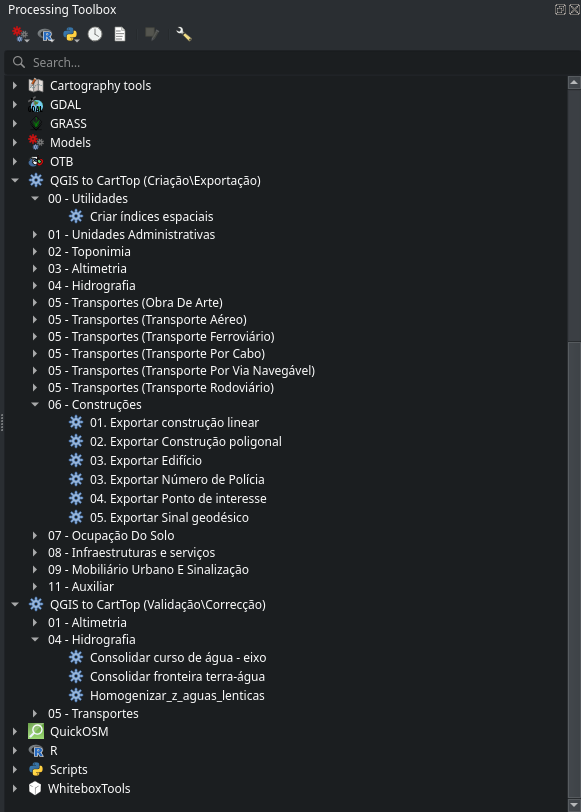
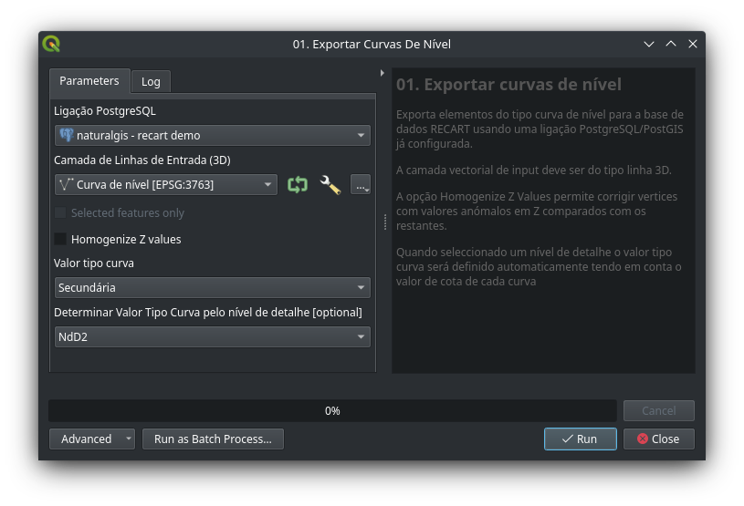
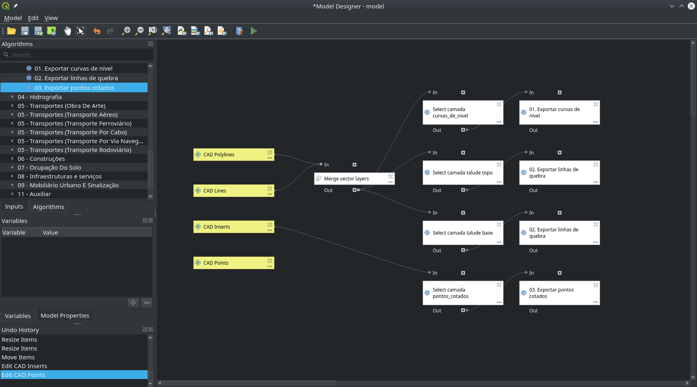
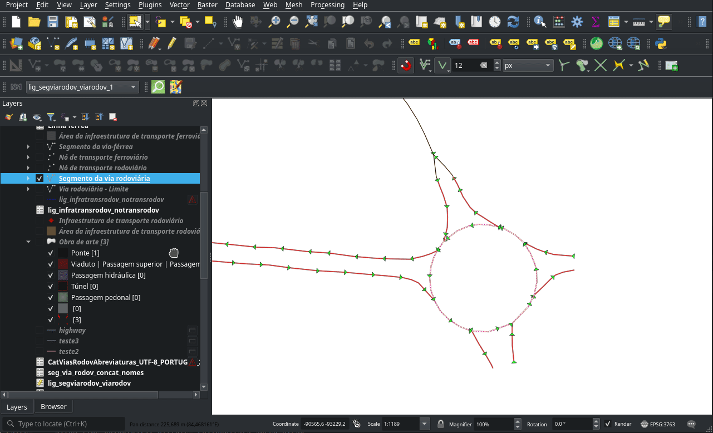

# QGIS2CartTop

Plugin QGIS de apoio à exportação, validação e correcção de dados cartográficos
de uma base de dados PostgreSQL/PostGIS de acordo com o modelo de dados definido
pelas **Normas e Especificações Técnicas para a Cartografia Vectorial e de
Imagem** ([CartTop / RECART](https://github.com/dgterritorio/RECART)) da autoria
da Direcção-Geral do Território.

O trabalho foi desenvolvido pela NaturalGIS (Alexandre Neto) com
co-financiamento da Inforgeo, Artop, Geoglobal e Geolayer.

Para uma descrição pormenorizada das ferramentas disponíveis, consulte a
descrição abaixo.

## Modelo de desenvolvimento

O plugin é publicado em duas versões distintas:

* Versão **Community** destinado à comunidade em geral, contém o conjunto
  de ferramentas desenvolvido à mais de 12 meses. Está disponível livremente
  através do repositório oficial do QGIS, em plugins.qgis.org. 

* Versão **Sponsors** destinado àqueles que contribuiram recentemente (até  
  12 meses) para o desenvolvimento do plugin, contendo todas as ferramentas
  desenvolvidas até então. Está disponível para download através do repositório
  privado da NaturalGIS em plugins.naturalgis.pt.

O desenvolvimento de novas ferramentas é feito a pedido de patrocinadores ou
através de acções de crowdfunding. Aqueles que contribuirem com mais de 500€ no
desenvolvimento de novas ferramentas ou melhoria das ferramentas existentes
ficam com acesso ao download da versão **Sponsors** pelo periodo de 12 meses após a publicação da nova ferramenta. Durante esse periodo receberão todas as
actualizações ao plugin, incluíndo, correcções de bugs, melhorias e novas
funcionalidades que sejam desenvolvidas entretanto.

Seguindo o modelo Open Source, após 12 meses da sua publicação na versão **sponsors**, os novos desenvolvimentos serão publicados na versão **Community** e o código fonte disponibilizado no repositório GitHub. 

## Descrição geral das ferramentas

* **Ferramentas de exportação** - Conjunto de 49 ferramentas de processamento 
  divididas pelas 11 categorias
  da CartTop para auxiliar a exportação de camadas do QGIS (ou fontes de dados
  externas) para as respectivas tabelas na base de dados RECART\CartTop de uma
  ligação PostgreSQL/PostGIS. Todas as ferramentas procuram garantir o correcto preenchimento dos campos obrigatórios de cada tabela. Algumas ferramentas
  possibilitam a exportação de várias tipologias de um objecto através de colunas
  auxiliares presentes nos dados de entrada.
  
  Algumas ferramentas de exportação possuem funcionalidades extras. Por exemplo,
  a ferramenta `01. Exportar curvas de nível` permite homogenizar os valores de Z
dos vértices para corrigir cotas erradas e pode, com base no nível de detalhe
da cartografia, determinar o Tipo de curva de nível (Mestra, secundária ou
auxiliar). Já a ferramenta `Exportar Unidades Administrativas de ficheiro CAOP`
determina automaticamente os distritos, concelhos e freguesias a exportar com
base na área de trabalho.

   

* **Ferramentas de Consolidação** - Conjunto de 6 ferramentas que permite consolidar dados de tabelas específicas 
unindo objectos adjacentes com os mesmos atributos (e.g. curvas de nível,
linhas de quebra, curso de água - eixo, segmentos da rede viária)

* **Ferramentas de Criação** - Conjunto ferramentas de facilitam a criação de 
  nós rodoviários,hidrográficos e ferroviários. Estas ferramentas usam as
  intersecções da respectiva rede para a criação dos nós e o contexto em que
  estão inseridos para tentar efectuar a devida classificação do valor tipo nó.

Todas as ferramenta descritas acima, enquanto pertencentes à *Processing 
Framework* beneficiam das seguintes funcionalidades:

* **History** - Carregando no icone do relógio na toolbox, é possivel visualizar e repetir as acções anteriores sem necessidade de voltar a preencher os formulários.
* **Batch mode** - Processar vários ficheiro/camadas ao mesmo tempo.
* **Model designer** - Ser usadas no modelador gráfico, intercaladas com outras ferramentas de processamento, permitindo a criação de modelos ETL (Extract Transform Load) complexos que automatizem a importação de dados provenientes ficheiros devidamente standarizados.

   

## Ferramentas exclusivas da versão **Sponsors**

Actualmente a versão **Sponsors** contém as seguintes funcionalidades extras:

* **Criar índices espaciais** - Ferramenta para criar índices espaciais em todas
  as tabelas geométricas da base de dados
* **Importar números de polícia** - Ferramenta de importação de uma camada de
  pontos contendo um ou mais números de polícia e que estabelece a relação com os edifícios nos quais estão os pontos estão contidos, preenchendo a tabela `numero_policia_edificio`
* **Criar relação n:1 nos elementos seleccionados** - Ferramenta que permite,
  após selecção de vários elementos de uma camada, estabelecer uma relação com elementos de outra tabela de uma só vez. Por exemplo, seleccionar vários segmentos de via rodoviária e adicionar-lhe uma via rodoviária. Ou seleccionar vários edifícios e atribuir-lhe um novo valor de utilização actual.

  

## Instalação

### Instalação versão Community

A versão Community está disponivel do repositório oficial do QGIS.

1. No QGIS, clique no menu **Plugins > Manage and install plugins**
2. Seleccione o separador **All** e procure por `qgis2carttop`.
3. Seleccione o plugin e escolha a opção **Install**

### Instalação versão Sponsors

A versão Sponsors requer a configuração do repositório da NaturalGIS e
e respectiva autenticação.

1. No QGIS, clique no menu **Plugins > Manage and install plugins**
2. Seleccione o separador **Settings**
3. Na lista **Plugins Repositories** clique em **Add**
4. Preencha a janela *Repository details* com as seguinte informação:
   * **Name**: `NaturalGIS Plugins`
   * **URL**: `https://plugins.naturalgis.pt`
   * **Authentication**: Preencher de acordo com as instruções que lhe foram enviadas por email.
5. Clique em **Reload respositories** 
6. Seleccione o separador **All** e procure por qgis2carttop.
7. Seleccione o plugin e escolha a opção **Install**

## Instruções de utilização

A maioria das ferramentas estão disponíveis através do painel de processamento (Ctrl+alt+t) nos grupos **QGIS to CartTop**. Apoś abertura das ferramentas, as instruções específicas podem ser encontradas no painel da direita.

A ferramenta de criação de relações 1:n está disponível na barra de ferramentas `qgis2carttop` que pode ser activada em **Settings > Toolbars > qgis2carttop**. Esta ferramenta usa as relações existentes para a camada activa. Para criar novas relações entre camadas deve usar o separador **Relations** nas propriedades do projecto (**Project > Properties...**). A forma mais simples é usar o botão **Discover relations** que lhe dará uma lista das relações encontradas na base de dados. Sugerimos que apenas adicione as relações necessárias ao trabaho a executar, ignorando as restantes.

