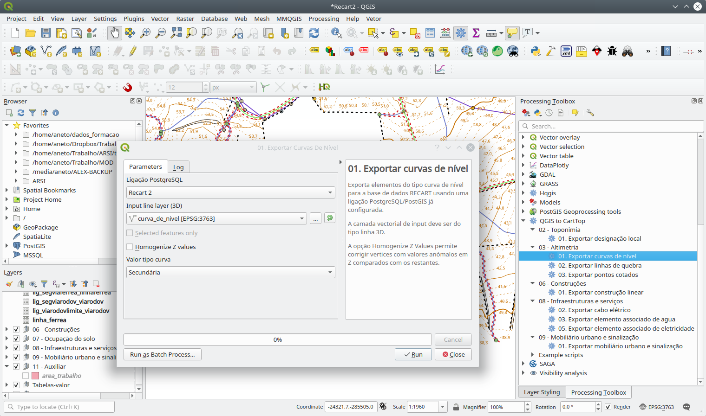

# qgis2CartTop

Plugin QGIS de auxílio à exportação de dados cartográficos
para uma base de dados PostgreSQL/PostGIS de acordo com o modelo
de dados definido pelas **Normas e Especificações Técnicas para a
Cartografia Vectoria e de Imagem** (CartTop / ReCart) da autoria da
Direcção-Geral do Território.

https://github.com/dgterritorio/RECART

